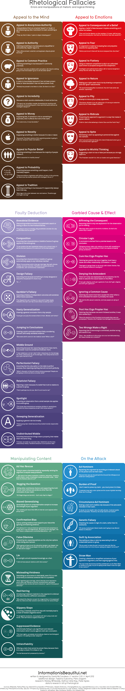

Text Books
----------

    - `10 RULES FOR RADICALS by CARL MALAMUD </doc/books/10rules-malamud.pdf>`_
    - `CODING FREEDOM: THE ETHICS AND AESTHETICS OF HACKING by E. GABRIELLA COLEMAN <../doc/books/Coleman-Coding-Freedom.pdf>`_
    - `RAPTURE OF THE NERDS by CORY DOCTOROW and CHARLES STROSS <../doc/books/Cory_Doctorow_and_Charles_Stross_-_Rapture_of_the_Nerds.pdf>`_
    - `HACKING POLITICS edited by DAVID MOON, PATRICK RUFFINI, AND DAVID SEGAL <../doc/books/hackingpolitics_txtwithcvfb.pdf>`_
    - `OPEN ADVICE: WHAT WE WISHED WE HAD KNOWN WHEN WE HAD STARTED edited by LYDIA PINTSCHER <../doc/books/Open-Advice.pdf>`_
    - `OPEN GOVERNMENT edited by DANIEL LATHROP and LAUREL RUMA <../doc/books/open_government.pdf>`_
    - `AN OPEN WORLD compiled by the contributing authors of http://opensource.com <../doc/books/open_source_eBook_AnOpenWorld_web.pdf>`_
    - `OPEN VOICES compiled by the contributing authors of http://opensource.com <../doc/books/open_source_eBook_OpenGovernment_print.pdf>`_
    - `OPEN MIDED CEOs compiled by the contributing authors of http://opensource.com <../doc/books/open_source_eBook_OpenMindedCEOs_web.pdf>`_
    - `HOW TO THINK LIKE A COMPUTER SCIENTIST: LEARNING WITH PYTHON by Allen Downey Jeffrey Elkner Chris Meyer <../doc/books/thinkCSpy.pdf>`_
    - `THINK PYTHON: HOW TO THINK LIKE A COMPUTER SCIENTIST by ALLEN DOWNEY <../doc/books/thinkpython.pdf>`_
    - `HOW TO TELL IF YOUR FLOSS PROJECT IS DOOMED TO FAIL by TOM 'SPOT' CALLAWAY <../doc/books/tomspotcallaway-howtotellifyourfossprojectisdoomedtofail.pdf>`_
    - `THE SUCCESS OF OPEN SOURCE by STEVE WEBER <../doc/books/Weber-SuccessofOpenSource-Chap3.pdf>`_

`How to NOT make Arguments <http://www.informationisbeautiful.net/visualizations/rhetological-fallacies/>`_
------------------------------------------------------------------------------------------------------------

